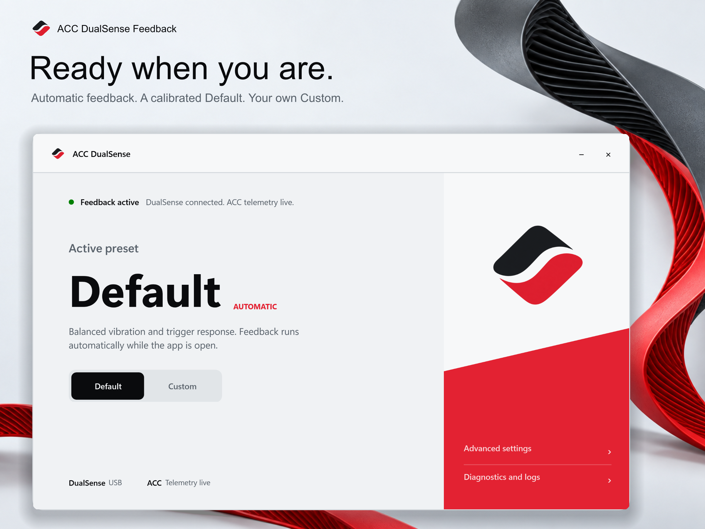
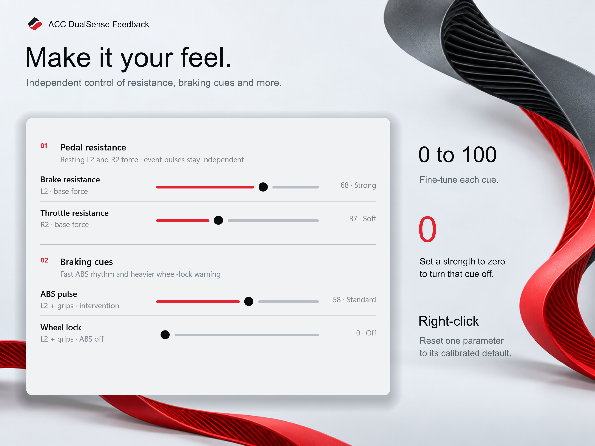

  
  
  
  

English · <a href="README.zh-CN.md">简体中文</a>

# ACC DualSense Feedback

A lightweight Windows companion that gives **Assetto Corsa Competizione** richer DualSense feedback—without turning your controller into a dashboard.

**[⬇ Download the latest portable release](https://github.com/Adudumax/ACC-DualSense-Feedback/releases/latest)** · [Quick start](#-quick-start) · [Get help](#-diagnostics--troubleshooting)

Connect your controller by USB, open the app, and drive. Feedback starts automatically when the DualSense and ACC are ready. Close the app to stop feedback and release the virtual controller; minimizing keeps it running.

## ✨ What you can feel

| Feedback | In your hands |
| --- | --- |
| Adaptive triggers | Progressive L2 brake resistance and a lighter R2 throttle response. |
| Braking and traction | Distinct ABS, wheel-lock, traction-control and wheelspin cues. |
| Shifts and engine | Upshift kick, redline pulses and a subtle RPM-linked engine texture. |
| Road and grip | Directional road and kerb detail, with distinct front/rear grip-loss textures across the two grips. |
| Contact | Impact feedback that responds to the direction and weight of a collision. |
| Your own feel | A calibrated Default preset plus independent Custom controls and per-parameter reset. |

The app forwards your physical controller through a virtual Xbox 360 controller so ACC receives normal input while the DualSense delivers the enhanced feedback.

## 📦 Download

Open **[the latest Release](https://github.com/Adudumax/ACC-DualSense-Feedback/releases/latest)** and choose one Windows x64 ZIP:

- **English:** `ACCDualSenseFeedback-v1.0.1-win-x64-portable.zip`
- **简体中文:** `ACCDualSenseFeedback-v1.0.1-win-x64-zh-CN-portable.zip`

Both editions use the same feedback engine and calibrated defaults. They are self-contained: no installer or separate .NET installation is required. Extract the ZIP and keep the included `licenses` folder beside the EXE.

## ✅ Before you drive

- Windows 10 or Windows 11, **x64**.
- Assetto Corsa Competizione for PC.
- DualSense or DualSense Edge connected by **USB**. Bluetooth is not supported.
- **ViGEmBus** virtual-controller driver: [download the official release](https://github.com/nefarius/ViGEmBus/releases).
- Steam Input **disabled for ACC**.
- If you use DS4Windows, keep it **fully closed** while this app is running.

Install **ViGEmBus**, not ViGEm.NET. The ViGEm.NET client is already included in the app. If ViGEmBus is already installed and working—for example from an earlier DS4Windows setup—you do not need to reinstall it.

**HidHide is optional.** Use it only if you need to prevent duplicate physical and virtual controller input. If HidHide already hides your DualSense, add the current `ACCDualSenseFeedback.exe` path to HidHide's **Applications** list so this app can still access the controller. Moving the EXE may require updating that allowed path.

## 🚀 Quick start

1. Download the ZIP and **extract it completely to a writable folder**. Do not run the EXE from inside the archive.
2. Install ViGEmBus if needed, then restart Windows if its installer asks you to.
3. Connect the DualSense by USB. If you use DS4Windows, fully exit it first.
4. Disable Steam Input in ACC's Steam controller settings.
5. If you use HidHide, allow this EXE as described above.
6. Open `ACCDualSenseFeedback.exe`, start ACC, and enter a driving session.

The home screen shows the connection state. Once everything is ready, feedback starts automatically—there is no Start or Stop button. Only one app instance can run at a time.

> [!WARNING]
> The EXE is currently unsigned, so Windows SmartScreen may show an unknown-publisher warning. Download it only from this repository's Release page.

## 🎛️ Default or Custom

Start with **Default** for the calibrated experience. Choose **Custom** or open **Advanced settings** when you want to tune individual cues:

- **Pedal resistance:** brake and throttle base resistance.
- **Braking:** ABS pulse and wheel-lock warning.
- **Powertrain:** engine texture, upshift kick and redline pulse.
- **Traction:** traction-control intervention and wheelspin warning.
- **Road and detail:** road/kerbs, grip loss, collision impact and original ACC vibration.

Strength controls cover **0–100 in one-point steps**. Setting a cue to **0 turns only that cue off**. Right-click a parameter row to restore its calibrated default. Changes apply immediately and select Custom; returning to Default does not erase your Custom values.

**Pulse begins** controls when redline feedback starts: **94.0%–99.0% of the car's maximum RPM**. It is a timing control, not another strength setting.

Custom values are stored beside the EXE in `ACCDualSenseFeedback.settings.json`. Keep that file when moving an already configured copy of the app. English and Chinese editions share the same settings format.

## 🩺 Diagnostics & troubleshooting

If something does not work, open **Diagnostics and logs → Copy diagnostic report**, then paste the complete report into a **[new GitHub issue](https://github.com/Adudumax/ACC-DualSense-Feedback/issues/new)**. Include your app language/version, controller model, what happened, and the steps needed to reproduce it.

| App status or symptom | What to check |
| --- | --- |
| DualSense unavailable | USB data cable and HidHide application access. |
| Feedback unavailable | ViGEmBus, USB and HidHide; attach the diagnostic report if the cause is unclear. |
| Action needed | Fully exit DS4Windows, then select **Check again**. |
| Waiting for ACC / driving | Start ACC and enter a driving session; the game menu is not a driving session. |
| Duplicate controller input | Disable Steam Input, close other controller emulators, and configure HidHide if needed. |

> [!NOTE]
> **Privacy:** session logs stay in memory and are cleared when the app closes. When you copy a diagnostic report, Windows user-profile directories and private HID device paths are redacted while useful error codes and call stacks are retained. Copy the report before closing the app.

The app does not install drivers automatically. If ViGEmBus is missing or another controller tool is blocking access, recovery guidance appears in the interface and the diagnostic report records the relevant state.

## 📝 Release notes

See **[Release notes](RELEASE_NOTES.md)** for the current version's highlights, requirements and known limitations.

## 📄 License & acknowledgements

ACC DualSense Feedback is open source under the **[MIT License](LICENSE)**. Bundled third-party components and the Chinese UI font retain their own licenses; see **[Third-party notices](THIRD_PARTY_NOTICES.md)** and the texts included in each portable package.

Thanks to Nefarius for ViGEmBus / ViGEm.NET, the ACC shared-memory community references, and the Noto Sans SC project used by the Chinese interface.
