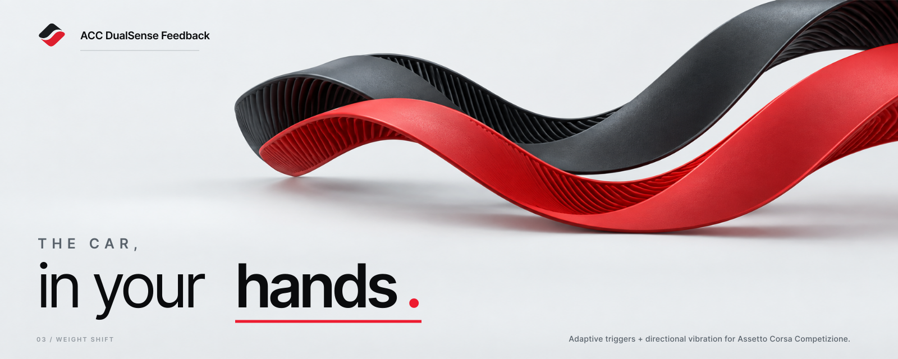

  
  
  
  

<a href="README.md">English</a> · 简体中文

# ACC DualSense Feedback

一款轻量的 Windows 伴随工具，为 **Assetto Corsa Competizione** 带来更丰富的 DualSense 震动与自适应扳机反馈。

**[⬇ 下载最新便携版](https://github.com/Adudumax/ACC-DualSense-Feedback/releases/latest)** · [快速开始](#-快速开始) · [诊断问题](#-诊断与故障排查)

USB 连接手柄，打开应用，然后进入驾驶。DualSense 与 ACC 就绪后，反馈会自动运行。关闭应用即可停止反馈并释放虚拟手柄；最小化不会停止运行。

## ✨ 你能感受到什么

| 反馈 | 手中的变化 |
| --- | --- |
| 自适应扳机 | L2 渐进刹车阻力与更轻的 R2 油门响应。 |
| 制动与牵引 | 清晰区分 ABS、车轮锁死、牵引力控制介入与驱动轮打滑。 |
| 换挡与发动机 | 升挡冲击、红线脉冲，以及随转速变化的微弱发动机底噪。 |
| 路面与抓地 | 路面、路肩的方向性细节，以及通过双握把不同纹理区分的前后轴抓地损失。 |
| 碰撞 | 根据碰撞方向与强度产生对应冲击反馈。 |
| 自定义手感 | 校准好的默认预设、独立模块调节与单项重置。 |

应用会将实体手柄输入转发为虚拟 Xbox 360 手柄供 ACC 正常识别，同时由 DualSense 提供增强反馈。

## 📦 下载

进入 **[最新 Release](https://github.com/Adudumax/ACC-DualSense-Feedback/releases/latest)**，选择一个 Windows x64 ZIP：

- **英文版：** `ACCDualSenseFeedback-v1.0.0-win-x64-portable.zip`
- **简体中文版：** `ACCDualSenseFeedback-v1.0.0-win-x64-zh-CN-portable.zip`

两个版本使用相同的反馈算法与校准参数。便携包已经包含 .NET 运行时，无需安装应用或另行安装 .NET；中文版也包含所需字体。完整解压后，请保留 EXE 随附的 `licenses` 文件夹。

## ✅ 开始前准备

- Windows 10 或 Windows 11，**x64**。
- PC 版 Assetto Corsa Competizione。
- 通过 **USB** 连接的 DualSense 或 DualSense Edge；暂不支持蓝牙。
- **ViGEmBus** 虚拟手柄驱动：[官方下载页](https://github.com/nefarius/ViGEmBus/releases)。
- 为 ACC **禁用 Steam Input**。
- 运行本应用时**完全退出 DS4Windows**。

需要安装的是 **ViGEmBus**，不是 ViGEm.NET；ViGEm.NET 客户端已经包含在应用中。如果电脑中已有正常工作的 ViGEmBus，例如以前使用 DS4Windows 时已经安装，就不必重复安装。

**HidHide 是可选项。** 只有在实体与虚拟手柄出现重复输入时才需要使用。如果 HidHide 已经隐藏 DualSense，请将当前 `ACCDualSenseFeedback.exe` 路径加入 HidHide 的 **Applications（应用程序）**允许列表，让本应用仍可访问手柄。移动 EXE 后可能需要更新允许路径。

## 🚀 快速开始

1. 下载 ZIP，**完整解压到可写入的文件夹**；不要直接在压缩包内运行 EXE。
2. 按需安装 ViGEmBus；如果安装程序要求重启，请先重启 Windows。
3. 用 USB 连接 DualSense，并完全退出 DS4Windows。
4. 在 Steam 的 ACC 控制器设置中禁用 Steam Input。
5. 如果使用 HidHide，按上文允许本应用访问手柄。
6. 打开 `ACCDualSenseFeedback.exe`，启动 ACC 并进入驾驶。

首页会显示当前连接状态。条件满足后反馈自动开始，无需点击开始或停止。同一时间只能运行一个应用实例。

> [!WARNING]
> 当前 EXE 未进行数字签名，因此 Windows SmartScreen 可能显示未知发布者提示。请只从本仓库的 Release 页面下载。

## 🎛️ 默认或自定义

建议先使用校准好的**默认预设**。需要调整时选择**自定义**或进入**高级设置**：

- **踏板阻力：** 刹车与油门的基础扳机阻力。
- **制动：** ABS 脉冲与车轮锁死提示。
- **动力：** 发动机底噪、升挡冲击与红线脉冲。
- **牵引：** 牵引力控制介入与驱动轮打滑提示。
- **路面与细节：** 路面/路肩、抓地损失、碰撞冲击与 ACC 原生震动。

反馈强度可在 **0–100 之间按 1 调节**。将某项设为 **0，只会关闭该项反馈**。右击参数行可恢复该项的校准默认值。修改会立即生效并切换至自定义；切回默认预设不会删除已保存的自定义数值。

**红线脉冲起点**控制反馈开始的时机，范围为车辆最高转速的 **94.0%–99.0%**；它不是强度设置。

自定义数值保存在 EXE 同目录的 `ACCDualSenseFeedback.settings.json`。移动已经调好的应用时，请一并保留此文件。中英文版使用相同的设置格式。

## 🩺 诊断与故障排查

遇到问题时，打开**诊断与日志 → 复制诊断报告**，将完整报告粘贴到 **[新的 GitHub Issue](https://github.com/Adudumax/ACC-DualSense-Feedback/issues/new)**。请同时说明应用版本与语言、手柄型号、实际现象和复现步骤。

| 状态或现象 | 建议检查 |
| --- | --- |
| 未检测到 DualSense | USB 数据线，以及 HidHide 是否允许本应用访问。 |
| 反馈不可用 | ViGEmBus、USB 与 HidHide；原因不明确时附上诊断报告。 |
| 需要处理 | 完全退出 DS4Windows，然后点击**重新检查**。 |
| 等待 ACC / 等待驾驶 | 启动 ACC 并进入驾驶；停留在游戏菜单不属于驾驶状态。 |
| 手柄重复输入 | 禁用 Steam Input、关闭其他手柄模拟工具，必要时配置 HidHide。 |

> [!NOTE]
> **隐私：** 会话日志只保存在内存中，并在应用关闭时清空。复制诊断报告时，Windows 用户目录和私密 HID 设备路径会被脱敏，同时保留有助于定位问题的错误码与调用栈。请在关闭应用前复制报告。

应用不会自动安装驱动。如果 ViGEmBus 缺失或其他手柄工具阻止了访问，界面会给出恢复提示，诊断报告也会记录相应状态。

## 📝 版本说明

当前版本的主要功能、使用条件和已知限制见 **[版本说明](RELEASE_NOTES.md)**。

## 📄 许可与致谢

ACC DualSense Feedback 采用 **[MIT 许可证](LICENSE)** 开源。随应用分发的第三方组件与中文字体保留各自许可，详见 **[第三方声明](THIRD_PARTY_NOTICES.md)** 以及便携包内的许可全文。

感谢 Nefarius 的 ViGEmBus / ViGEm.NET、ACC 共享内存社区参考资料，以及中文版界面使用的 Noto Sans SC 项目。

本项目是独立伴随工具，与 Kunos Simulazioni 或 Sony Interactive Entertainment 不存在隶属或官方认可关系。
